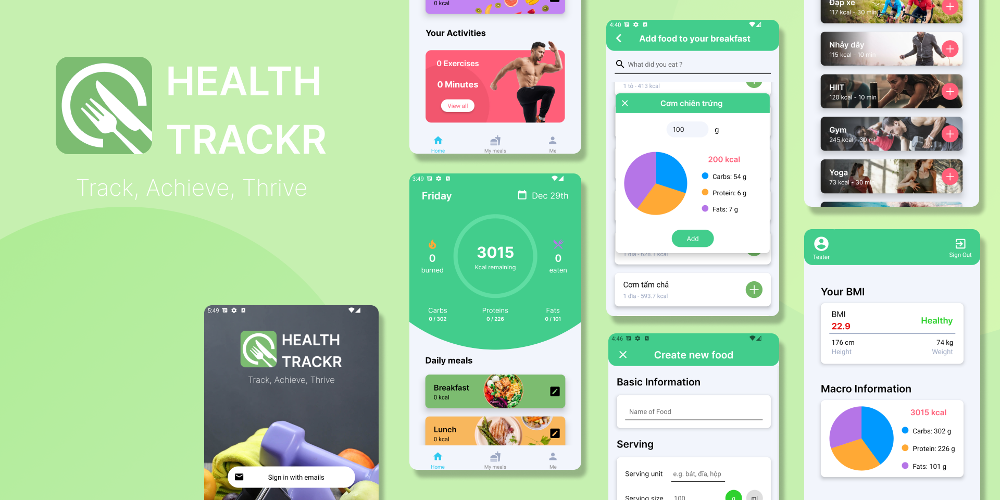

# 🥑 Calorie Counter & Fitness Tracker App 🏃🏻‍♂️

 

A mobile app project, built using <a href="https://reactnative.dev/">React Native ⚛️</a> & <a href="https://firebase.google.com/">Firebase 🔥</a>

## Features 🥝
+ Register and sign-in using email and password
+ Automatically calculate user's BMI and macronutrients
+ Easy tracking over calorie intake and physical activities
+ Comes with database of food, nutritional values and exercises.
+ Compatible with both iOS and Android

## Installation 🛠️
1. Run `npm install`.
2. Run `npx expo start` to start the app.
3. Enter `a` or `i` to run the app in an Android or iOS emulator.